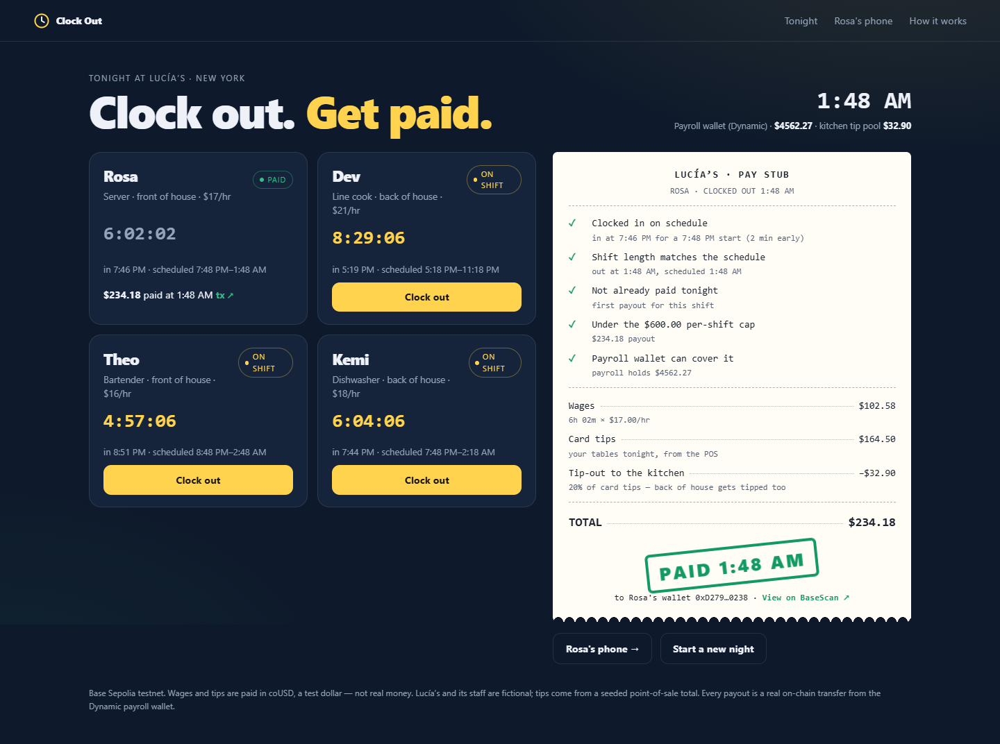
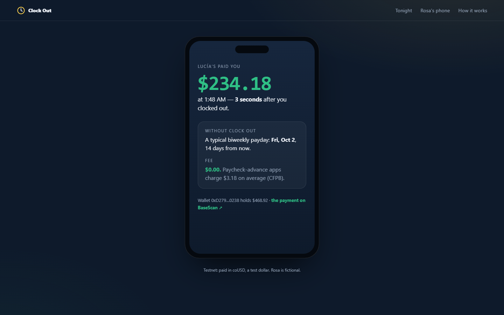
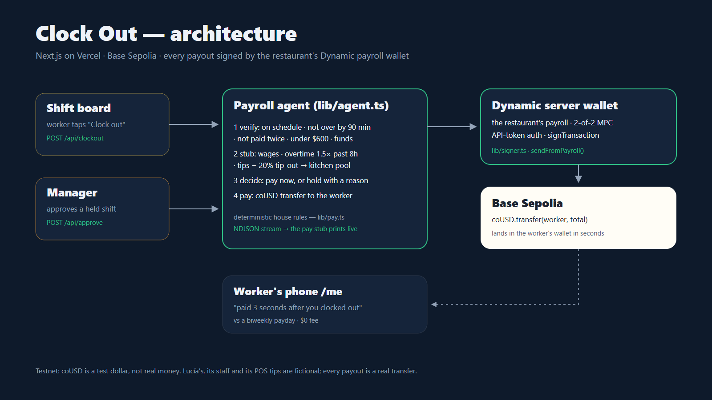

# Clock Out

**Clock out. Get paid.** When a shift ends, an agent checks it against the schedule, builds the pay
stub — wages, overtime, tips, and a tip-out for the kitchen — and pays the worker right then from
the restaurant's Dynamic payroll wallet. If something doesn't add up, it holds the payout and says why.

**Live demo: [clock-out-six.vercel.app](https://clock-out-six.vercel.app)** — clocking out there makes a real payout on Base
Sepolia. · **Video: [youtu.be/-S2cXQXgL8M](https://youtu.be/-S2cXQXgL8M)**

Built for [Runtime](https://runtime.nyc/) — Dynamic track and the Bankr grand prize.



---

## The problem

The money is already earned when the shift ends. It waits up to two weeks because payroll runs in
batches — and people pay to get it sooner.

- In 2022, **7.2 million workers** used employer-partnered paycheck advances, taking **$22.8 billion**
  of wages they had already earned, across **214 million** transactions. The typical APR on those
  advances was **109.5%**, and roughly **90%** of workers paid at least one fee; the average fee was
  **$3.18**.
  — CFPB, [*Data Spotlight: Developments in the Paycheck Advance Market*](https://www.consumerfinance.gov/data-research/research-reports/data-spotlight-developments-in-the-paycheck-advance-market/), July 18 2024
- The fallback is worse: a typical two-week payday loan at $15 per $100 *"equates to an annual
  percentage rate of almost 400 percent"*.
  — CFPB, [*What are the costs and fees for a payday loan?*](https://www.consumerfinance.gov/ask-cfpb/what-are-the-costs-and-fees-for-a-payday-loan-en-1589/)

Restaurants add a second problem: tips pool at the front of the house. The kitchen — the line cook,
the dishwasher — often sees none of it, or sees it weeks later.

## What it does

A night at Lucía's, a fictional restaurant:

1. **Rosa (server) clocks out on time.** The agent runs five checks — clocked in on schedule, shift
   length matches the schedule, not already paid, under the per-shift cap, payroll can cover it — and
   prints her pay stub line by line: wages, her card tips, and a **20% tip-out to the kitchen**. All
   clear, so the **payroll wallet pays her immediately**. Her phone shows *"paid 3 seconds after you
   clocked out"*, next to the biweekly payday she'd otherwise wait for and the $0 fee.
2. **Dev (line cook) ran 2½ hours past schedule.** The agent computes his overtime at 1.5× past 8 hours
   and his share of the kitchen tip pool — including the tip-out Rosa just paid in — and then
   **holds** the payout: *overtime needs a manager's OK.*
3. **A manager approves.** The agent re-runs every check, marks the overrun as cleared by a manager,
   and pays Dev. Hard checks — double payment, insufficient funds — can't be overridden by anyone.

**What the human still decides:** anything unusual. The agent pays ordinary shifts on its own and
refuses the rest with a reason. The rules are plain code ([`lib/pay.ts`](lib/pay.ts)), not a model.



---

## How we use Dynamic

**Wallet pattern: server wallet.** The restaurant's payroll wallet is a Dynamic server wallet owned
by the app's developer account; the agent authenticates with an API token and signs with the
wallet's password. It is 2-of-2 MPC with key shares backed up to Dynamic, so no raw private key
exists on the server.

**The agent decides, then Dynamic pays:**

| What | Where |
|---|---|
| The settle flow: verify → stub → decide → pay | [`lib/agent.ts` L30](lib/agent.ts#L30) |
| The decision — which failing checks a manager may clear, and which no one can | [`lib/agent.ts` L59–L60](lib/agent.ts#L59-L60) |
| The payment — a coUSD transfer from the payroll wallet to the worker | [`lib/agent.ts` L70–L78](lib/agent.ts#L70-L78) |
| Signing with the Dynamic server wallet (`signTransaction`), broadcast, receipt | [`lib/signer.ts` L66](lib/signer.ts#L66) · [L83](lib/signer.ts#L83) |
| Creating the payroll wallet (`createWalletAccount`, `TWO_OF_TWO`, backed up to Dynamic) | [`scripts/wallet.mjs`](scripts/wallet.mjs) |
| The checks and the pay stub | [`lib/pay.ts` L66 `checks()`](lib/pay.ts#L66) · [L25 `payStub()`](lib/pay.ts#L25) |
| House rules (tip-out %, overtime, cap, tolerances) | [`lib/night.ts` L39](lib/night.ts#L39) |

Dynamic's signer runs on Linux and macOS only; [`lib/signer.ts` L22](lib/signer.ts#L22) makes the app
say "signing unavailable" anywhere else rather than pretend.

### Bankr

Every Runtime entry is eligible for the Bankr grand prize, which asks for products that disrupt the
financial stack with stablecoins and payments. Payroll is the oldest batch process in that stack;
Clock Out settles each shift the moment it ends, so a paycheck advance has nothing left to advance.



---

## What is live, and what isn't

| | |
|---|---|
| Payroll wallet and payouts | **Live** — a Dynamic server wallet signing real coUSD transfers on Base Sepolia. |
| The money | **Test dollars** (coUSD) — not real money. In production this would be USDC. |
| The night | **Seeded** — Lucía's, its four staff and their schedules are fictional, and card tips come from a seeded point-of-sale total. |
| Worker wallets | Addresses derived from each name ([`lib/chain.ts` L20](lib/chain.ts#L20)); no one holds their keys, and they only receive test dollars. |
| Demo state | The night lives in a JSON file (`/tmp` on Vercel, so per-instance). "Start a new night" resets it and tops up the payroll wallet with test dollars if it runs low. |

Built from scratch during the hackathon; [Claude Code](https://claude.com/claude-code) was used as a
coding assistant, and the video's narration was generated with ElevenLabs.

## Run it locally

```bash
pnpm install
pnpm build && pnpm start      # http://localhost:3000
```

The board, stubs and decisions work with no configuration. To pay out, set `DYNAMIC_ENV_ID` and
`DYNAMIC_API_TOKEN` in `.env`, run `pnpm wallet create` (writes the payroll wallet into `.env`), then
`pnpm wallet fund` (needs `DEPLOYER_PRIVATE_KEY`, the owner of the test dollar). Signing needs Linux or
macOS (use WSL on Windows). To deploy your own test dollar: `pnpm setup:chain`.

## License

[MIT](LICENSE)
